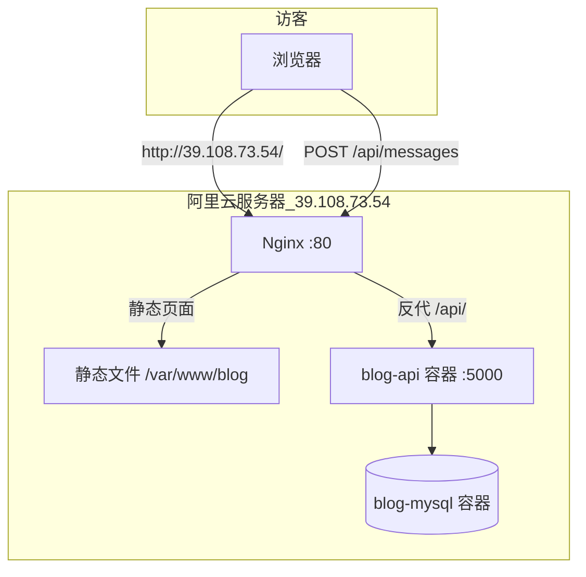

# 墨言博客 · 个人博客全栈项目

纯前端博客 + C# 留言 API + MySQL，支持本地 Docker 开发与阿里云服务器生产部署。

**线上演示（当前部署）：** [http://39.108.73.54/](http://39.108.73.54/)

---

## 一、项目结构

```
20260527demo/
├── blog/                      # 静态前端（HTML / CSS / JS）
│   ├── index.html
│   ├── css/style.css
│   └── js/
│       ├── script.js          # 页面逻辑、联系表单提交
│       ├── config.js          # API 地址（生产环境，勿提交敏感信息）
│       └── config.example.js
├── blog-api/                  # ASP.NET Core 8 留言 API
│   ├── Controllers/
│   ├── Data/
│   ├── Models/
│   ├── Migrations/
│   └── Dockerfile
├── docker-compose.yml         # 本地开发：MySQL + API
├── docker-compose.prod.yml    # 生产环境：MySQL + API（仅内网端口）
├── .env.production.example    # 生产环境变量模板
├── deploy/nginx/              # Nginx 配置示例
├── DOCKER.md                  # 本地 Docker 说明
├── DEPLOY.md                  # API 部署说明（通用）
├── DEPLOY-CLOUD.md            # 云服务器部署概要
└── README.md                  # 本文档：完整发布流程说明
```

---

## 二、整体架构（你上线后的样子）



| 组件 | 作用 | 运行位置 |
|------|------|----------|
| **Nginx** | 对外提供 80 端口；托管博客页面；把 `/api/` 转给后端 | 宿主机（Alibaba Cloud Linux 3） |
| **blog/** | 博客首页、样式、联系表单 | `/var/www/blog` |
| **blog-api** | 接收留言、写入数据库；管理接口需密钥 | Docker 容器，仅 `127.0.0.1:5000` |
| **MySQL** | 存储 `messages` 表 | Docker 容器，**不**对公网开放 3306 |

---

## 三、部署完成了吗？

### 已完成（核心流程）

- [x] 云服务器（阿里云轻量，Docker CE 镜像，Alibaba Cloud Linux 3）
- [x] Docker 运行 **MySQL + blog-api**
- [x] 数据库迁移与 `messages` 表
- [x] Nginx 托管前端 + 反向代理 API
- [x] 公网可通过 IP 访问博客：http://39.108.73.54/
- [x] 联系表单可提交留言到数据库（需 CORS / `config.js` 配置正确）

### 建议后续再做（非必须，但生产推荐）

- [ ] **HTTPS**：有域名后用 `certbot` 申请免费证书
- [ ] **域名 + ICP 备案**：大陆服务器使用自有域名通常需要备案
- [ ] **修改默认密钥**：`.env` 中的 `ADMIN_API_KEY`、`MYSQL_ROOT_PASSWORD` 使用强随机值
- [ ] **定期备份** MySQL 数据
- [ ] 本机 **SSH**（可选）：配置安全组 22 + 密钥登录，便于不用 Workbench 也能维护

**结论：** 以「IP + HTTP 访问博客 + 留言入库」为目标，**主要发布流程已经完成**。剩下的是安全加固与域名美化。

---

## 四、你具体做了什么？（按时间顺序详解）

下面是你从本机开发到 http://39.108.73.54/ 可访问的完整过程，以及**每一步在解决什么问题**。

### 阶段 1：本机开发与验证

| 你做的事 | 目的 |
|----------|------|
| 用 HTML/CSS/JS 写博客页面 | 静态展示，无需服务器渲染 |
| 创建 `blog-api`（C# + EF Core + MySQL） | 留言持久化到数据库，不暴露数据库给浏览器 |
| `docker compose up` 本地跑 MySQL + API | 本机联调，模拟生产环境 |
| `blog/js/config.js` 指向 `http://localhost:5059` | 前端知道 API 地址 |
| Live Server / `npx serve` 打开前端 | 避免 `file://` 导致 CORS 失败 |

### 阶段 2：购买与登录服务器

| 你做的事 | 目的 |
|----------|------|
| 购买阿里云轻量服务器（2vCPU 4GiB，**Docker CE 应用镜像**） | 预装 Docker，省去自己安装 |
| 系统：Alibaba Cloud Linux 3 | 使用 `dnf` 装软件（无 `apt`） |
| Workbench 远程连接 | 公网 SSH 超时时，仍可通过网页终端操作 |
| 用户名 `admin`（非 root） | 符合镜像默认账号 |

### 阶段 3：上传代码与配置生产环境

| 你做的事 | 目的 |
|----------|------|
| 将项目放到服务器 `~/blog-project`（git clone 或 zip 上传） | 服务器上有完整源码与 Docker 配置 |
| 创建 `.env`（由 `.env.production.example` 复制） | 注入数据库密码、管理密钥、前端地址（CORS） |
| `FRONTEND_ORIGIN=http://39.108.73.54` | 允许浏览器从该来源跨域调用 API |

`.env` 示例含义：

```env
MYSQL_ROOT_PASSWORD=...    # Docker 内 MySQL root 密码
ADMIN_API_KEY=...          # 查看留言列表时请求头 X-Admin-Key
FRONTEND_ORIGIN=http://39.108.73.54   # 必须与浏览器地址栏一致
```

### 阶段 4：Docker 启动后端

| 你做的事 | 目的 |
|----------|------|
| `sudo docker compose -f docker-compose.prod.yml up -d --build` | 构建 API 镜像并启动两个容器 |
| 遇到 `permission denied` → 使用 `sudo` | `admin` 用户默认不在 docker 组 |
| `blog-mysql` 健康检查后启动 `blog-api` | 保证 API 启动时数据库已就绪 |
| API 监听 `127.0.0.1:5000` | 仅本机可访问，外网通过 Nginx 反代，更安全 |

`docker-compose.prod.yml` 与本地 `docker-compose.yml` 的区别：

- 生产环境变量 `ASPNETCORE_ENVIRONMENT=Production`
- MySQL **不**映射 3306 到公网
- API 只绑定 `127.0.0.1:5000`，不直接暴露 5059 给外网

### 阶段 5：Nginx 部署前端并反代 API

| 你做的事 | 目的 |
|----------|------|
| `sudo dnf install -y nginx` | ALinux 3 用 dnf 安装 Web 服务器（不是 apt） |
| `sudo cp -r blog/* /var/www/blog/` | 博客静态资源目录 |
| 写入 `/var/www/blog/js/config.js` | 前端请求 `http://39.108.73.54` 上的 API |
| 配置 `/etc/nginx/conf.d/blog.conf` | 同一 IP：`/` 走静态文件，`/api/` 转发到 `127.0.0.1:5000` |
| `sudo nginx -t && sudo systemctl reload nginx` | 校验配置并生效 |
| 阿里云防火墙放行 **80** | 外网才能访问 HTTP |

### 阶段 6：浏览器验证

| 你做的事 | 结果 |
|----------|------|
| 打开 http://39.108.73.54/ | 看到博客页面 |
| 填写「保持联系」并提交 | `script.js` → `POST /api/messages` → API → MySQL |
| 成功提示 Toast | 前后端与数据库链路打通 |

---

## 五、一次留言提交的完整数据流

```
1. 用户在 http://39.108.73.54/ 填写表单
2. script.js 读取 config.js 中的 apiBaseUrl
3. fetch POST http://39.108.73.54/api/messages  （或同域 /api/messages）
4. Nginx 将 /api/ 转发到 http://127.0.0.1:5000/api/
5. blog-api 校验字段，INSERT 到 blog_db.messages
6. 返回 201，前端显示「消息已发送」
```

查看已提交留言（仅管理员，需密钥）：

```bash
curl -s http://127.0.0.1:5000/api/messages \
  -H "X-Admin-Key: 你的ADMIN_API_KEY"
```

---

## 六、日常运维命令（Workbench 或 SSH）

```bash
cd ~/blog-project

# 查看容器状态
sudo docker compose -f docker-compose.prod.yml ps

# 查看 API 日志
sudo docker compose -f docker-compose.prod.yml logs -f blog-api

# 更新代码后重新构建 API
sudo docker compose -f docker-compose.prod.yml up -d --build

# 更新前端静态文件
sudo cp -r ~/blog-project/blog/* /var/www/blog/
# 注意保留生产环境 config.js 中的 apiBaseUrl

# 重载 Nginx
sudo nginx -t && sudo systemctl reload nginx

# 备份数据库
sudo docker exec blog-mysql mysqldump -uroot -p你的密码 blog_db > ~/backup-$(date +%F).sql
```

---

## 七、本地开发快速开始

```powershell
cd d:\Cursor\20260527demo
copy .env.example .env
docker compose up -d --build
copy blog\js\config.example.js blog\js\config.js
```

- API：http://localhost:5059/swagger  
- 前端：用 Live Server 打开 `blog/index.html`  

详见 [DOCKER.md](./DOCKER.md)。

---

## 八、相关文档

| 文档 | 说明 |
|------|------|
| [DOCKER.md](./DOCKER.md) | 本机 Docker 开发与联调 |
| [DEPLOY-CLOUD.md](./DEPLOY-CLOUD.md) | 云服务器部署步骤摘要 |
| [DEPLOY.md](./DEPLOY.md) | API、CORS、安全清单 |
| [blog-api/README.md](./blog-api/README.md) | 接口说明 |

---

## 九、API 接口摘要

| 方法 | 路径 | 权限 | 说明 |
|------|------|------|------|
| POST | `/api/messages` | 公开 | 提交留言 `{ name, email, content }` |
| GET | `/api/messages` | `X-Admin-Key` | 分页列表 |
| GET | `/api/messages/{id}` | `X-Admin-Key` | 单条详情 |

---

## 十、常见问题

**Q: 页面能开，留言失败？**  
检查 `config.js` 的 `apiBaseUrl`、`.env` 的 `FRONTEND_ORIGIN` 是否与浏览器地址一致；F12 看 Network 里 `/api/messages` 的状态码。

**Q: 为什么不用 apt？**  
服务器是 Alibaba Cloud Linux 3，请用 `sudo dnf install ...`。

**Q: Docker 命令都要 sudo？**  
可将用户加入 docker 组：`sudo usermod -aG docker admin` 后重新登录。

**Q: GitHub Pages 还要吗？**  
可选。前端可继续放 GitHub Pages，只需把 `config.js` 指向 `http://39.108.73.54` 或未来的 `https://api.域名`，并在 `.env` 里设置对应的 `FRONTEND_ORIGIN`。

---

## 十一、技术栈

- 前端：原生 HTML、CSS、JavaScript  
- 后端：ASP.NET Core 8、Entity Framework Core  
- 数据库：MySQL 8  
- 容器：Docker、Docker Compose  
- 反向代理：Nginx  
- 云平台：阿里云轻量应用服务器（Alibaba Cloud Linux 3）

---

*最后更新：2026-05-29 · 对应线上环境 http://39.108.73.54/*
