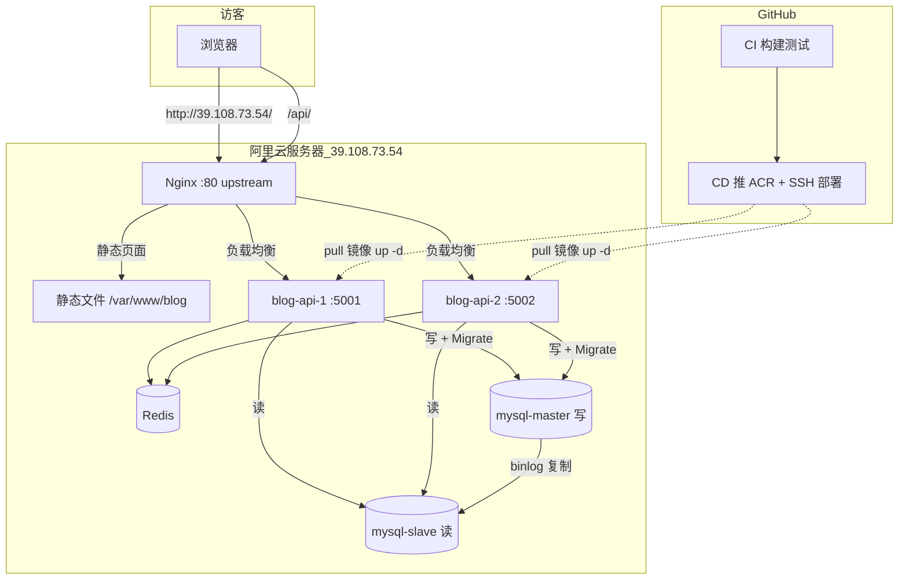

# 墨言博客 · 个人博客全栈项目

纯前端博客 + C# 留言 API + MySQL，支持本地 Docker 开发与阿里云服务器生产部署。

**线上演示（当前部署）：** [http://39.108.73.54/](http://39.108.73.54/)

---

## 一、项目结构

```
20260527demo/
├── blog/                      # 静态前端（HTML / CSS / JS）
│   ├── index.html
│   ├── admin.html             # 管理后台（留言列表、登录、删除）
│   ├── css/style.css
│   └── js/
│       ├── script.js          # 页面逻辑、联系表单提交
│       ├── admin.js           # 管理后台逻辑
│       ├── config.js          # API 地址（生产环境，勿提交敏感信息）
│       └── config.example.js
├── blog-api/                  # ASP.NET Core 8 留言 API
│   ├── Controllers/
│   ├── Data/
│   ├── Models/
│   ├── Migrations/
│   └── Dockerfile
├── docker-compose.yml         # 本地开发：MySQL + API
├── docker-compose.prod.yml    # 生产单库（历史/兜底，现网已升级主从）
├── docker-compose.replica.yml # 生产主从：MySQL 主从 + Redis + 双 API
├── .github/workflows/         # CI 测试构建；CD 推 ACR 并 SSH 部署
├── .env.production.example    # 生产环境变量模板
├── deploy/nginx/              # Nginx 配置示例（upstream 5001/5002）
├── DOCKER.md                  # 本地 Docker 说明
├── DEPLOY.md                  # API 部署说明（通用）
├── DEPLOY-CLOUD.md            # 云服务器部署概要
├── TECH.md                    # 架构技术归纳与中级学习路线
└── README.md                  # 本文档：完整发布流程说明
```

---

## 二、整体架构（生产环境 · 当前）

> **日常发布以 GitHub Actions CD 为准**（`main` 分支 CI 通过后自动推镜像到阿里云 ACR 并 SSH 部署）。  
> 下文「手动 `git pull` + compose」仅作 **CD 不可用时的兜底**，详见 [12.7 发布流程](#127-发布流程github--服务器)。


```mermaid
flowchart TB
  subgraph 访客
    U[浏览器]
  end
  subgraph GitHub
    CI[CI 构建测试]
    CD[CD 推 ACR + SSH 部署]
    CI --> CD
  end
  subgraph 阿里云服务器_39.108.73.54
    N[Nginx :80 upstream]
    F[静态文件 /var/www/blog]
    A1[blog-api-1 :5001]
    A2[blog-api-2 :5002]
    R[(Redis)]
    M[(mysql-master 写)]
    S[(mysql-slave 读)]
  end
  U -->|http://39.108.73.54/| N
  N -->|静态页面| F
  U -->|/api/| N
  N -->|负载均衡| A1
  N -->|负载均衡| A2
  A1 -->|写 + Migrate| M
  A2 -->|写 + Migrate| M
  A1 -->|读| S
  A2 -->|读| S
  A1 --> R
  A2 --> R
  M -->|binlog 复制| S
  CD -.->|pull 镜像 up -d| A1
  CD -.->|pull 镜像 up -d| A2
```

| 组件 | 作用 | 运行位置 |
|------|------|----------|
| **GitHub CI/CD** | CI 跑测试与镜像构建；CD 推 ACR 并 SSH 更新 API 容器 | GitHub Actions |
| **Nginx** | 对外 80；托管静态页；`upstream` 把 `/api/` 分到两个 API | 宿主机（Alibaba Cloud Linux 3） |
| **blog/** | 博客首页、样式、联系表单 | `/var/www/blog`（**暂未纳入 CD**，改前端需手动同步） |
| **blog-api-1 / blog-api-2** | 双实例负载均衡；写主库、读从库；管理接口需密钥 | Docker，`127.0.0.1:5001` / `5002` |
| **mysql-master / mysql-slave** | 主库写 + 从库读（读写分离）；**不对公网开放 3306** | Docker（`docker-compose.replica.yml`） |
| **Redis** | 留言列表缓存 | Docker，仅容器内网 |

Compose 与文档：`docker-compose.replica.yml`（现网）、`DEPLOY-REPLICA.md`（主从部署详解）；`docker-compose.prod.yml` 保留作单库兜底参考。

---

## 三、部署完成了吗？

### 已完成（核心流程）

- [x] 云服务器（阿里云轻量，Docker CE 镜像，Alibaba Cloud Linux 3）
- [x] Docker 运行 **MySQL 主从 + Redis + 双 blog-api**（`docker-compose.replica.yml`）
- [x] GitHub **CI**（测试 + 构建镜像）与 **CD**（推 ACR + SSH 部署 API）
- [x] 数据库迁移与 `messages` 表；API 读写分离（写主库、读从库）
- [x] Nginx 托管前端 + `upstream` 负载均衡反代 API（5001/5002）
- [x] 公网可通过 IP 访问博客：http://39.108.73.54/
- [x] 联系表单可提交留言到数据库（需 CORS / `config.js` 配置正确）
- [x] 管理后台 `admin.html`（账号密码登录、留言列表、删除）

### 建议后续再做（非必须，但生产推荐）

- [ ] **HTTPS**：有域名后用 `certbot` 申请免费证书
- [ ] **域名 + ICP 备案**：大陆服务器使用自有域名通常需要备案
- [ ] **修改默认密钥**：`.env` 中的 `ADMIN_API_KEY`、`MYSQL_ROOT_PASSWORD` 使用强随机值
- [ ] **定期备份** MySQL 数据
- [ ] 本机 **SSH**（可选）：配置安全组 22 + 密钥登录，便于不用 Workbench 也能维护

**结论：** 以「IP + HTTP 访问博客 + 留言入库」为目标，**主要发布流程已经完成**。剩下的是安全加固与域名美化。

---

## 四、你具体做了什么？（按时间顺序详解）

下面是从本机开发到 http://39.108.73.54/ 可访问的完整过程。**阶段 4～5 描述最初单库 + 单 API 上线**；现网已升级为 **主从 + Redis + 双 API + GitHub CD**（见 [第二节](#二整体架构生产环境--当前)）。后续 API 发布以 CD 为准。

### 阶段 1：本机开发与验证

| 你做的事 | 目的 |
|----------|------|
| 用 HTML/CSS/JS 写博客页面 | 静态展示，无需服务器渲染 |
| 创建 `blog-api`（C# + EF Core + MySQL） | 留言持久化到数据库，不暴露数据库给浏览器 |
| `docker compose up` 本地跑 MySQL + API | 本机联调，模拟生产环境 |
| `blog/js/config.js` 指向 `http://localhost:5059` | 前端知道 API 地址 |
| Live Server / `npx serve` 打开前端 | 避免 `file://` 导致 CORS 失败 |

### 阶段 2：购买与登录服务器

| 你做的事 | 目的 |
|----------|------|
| 购买阿里云轻量服务器（2vCPU 4GiB，**Docker CE 应用镜像**） | 预装 Docker，省去自己安装 |
| 系统：Alibaba Cloud Linux 3 | 使用 `dnf` 装软件（无 `apt`） |
| Workbench 远程连接 | 公网 SSH 超时时，仍可通过网页终端操作 |
| 用户名 `admin`（非 root） | 符合镜像默认账号 |

### 阶段 3：上传代码与配置生产环境

| 你做的事 | 目的 |
|----------|------|
| 将项目放到服务器 `~/blog-project`（git clone 或 zip 上传） | 服务器上有完整源码与 Docker 配置 |
| 创建 `.env`（由 `.env.production.example` 复制） | 注入数据库密码、管理密钥、前端地址（CORS） |
| `FRONTEND_ORIGIN=http://39.108.73.54` | 允许浏览器从该来源跨域调用 API |

`.env` 示例含义：

```env
MYSQL_ROOT_PASSWORD=...    # Docker 内 MySQL root 密码
ADMIN_API_KEY=...          # 脚本/curl 调管理接口时用（X-Admin-Key）
ADMIN_USERNAME=admin       # 管理后台登录账号
ADMIN_PASSWORD=...         # 管理后台登录密码
FRONTEND_ORIGIN=http://39.108.73.54   # 必须与浏览器地址栏一致
```

### 阶段 4：Docker 启动后端（初版单库；现网见 `docker-compose.replica.yml`）

| 你做的事 | 目的 |
|----------|------|
| `sudo docker compose -f docker-compose.prod.yml up -d --build` | 初版：单 MySQL + 单 API |
| 现网：`docker-compose.replica.yml` + GitHub CD | 主从 + Redis + 双 API；API 由 CD 从 ACR 拉镜像 |
| API 监听 `127.0.0.1:5001` / `5002`（现网） | 仅本机可访问，外网通过 Nginx upstream 反代 |

`docker-compose.prod.yml` 与 `docker-compose.replica.yml` 的区别：

- **prod**：单 MySQL + 单 API（`5000`），适合初次上手或兜底
- **replica（现网）**：主从 MySQL、Redis、双 API；写主读从；CD 部署目标

### 阶段 5：Nginx 部署前端并反代 API

| 你做的事 | 目的 |
|----------|------|
| `sudo dnf install -y nginx` | ALinux 3 用 dnf 安装 Web 服务器（不是 apt） |
| `sudo cp -r blog/* /var/www/blog/` | 博客静态资源目录 |
| 写入 `/var/www/blog/js/config.js` | 前端请求 `http://39.108.73.54` 上的 API |
| 配置 `/etc/nginx/conf.d/blog.conf` | `/` 走静态文件；`/api/` 经 `upstream` 转发到 5001/5002 |
| `sudo nginx -t && sudo systemctl reload nginx` | 校验配置并生效 |
| 阿里云防火墙放行 **80** | 外网才能访问 HTTP |

### 阶段 6：浏览器验证

| 你做的事 | 结果 |
|----------|------|
| 打开 http://39.108.73.54/ | 看到博客页面 |
| 填写「保持联系」并提交 | `script.js` → `POST /api/messages` → API → MySQL |
| 成功提示 Toast | 前后端与数据库链路打通 |

---

## 五、一次留言提交的完整数据流

```
1. 用户在 http://39.108.73.54/ 填写表单
2. script.js 读取 config.js 中的 apiBaseUrl
3. fetch POST http://39.108.73.54/api/messages  （或同域 /api/messages）
4. Nginx upstream 将 /api/ 轮询转发到 blog-api-1:5001 或 blog-api-2:5002
5. API 校验字段，INSERT 到 mysql-master（主库），并失效 Redis 列表缓存
6. 返回 201，前端显示「消息已发送」
```

查看已提交留言（仅管理员，需密钥；读请求走从库 + 可能命中 Redis）：

```bash
curl -s http://127.0.0.1:5001/api/messages \
  -H "X-Admin-Key: 你的ADMIN_API_KEY"
```

---

## 六、日常运维命令（Workbench 或 SSH）

> **改 `blog-api/` 并 push 到 `main` 后，优先等 GitHub CD 自动部署**；本节命令用于查看状态、更新前端、或 CD 失败时手动兜底。

```bash
cd ~/blog-project
COMPOSE=docker-compose.replica.yml

# 查看容器状态（主从 + Redis + 双 API）
sudo docker compose -f $COMPOSE ps

# 查看 API 日志
sudo docker compose -f $COMPOSE logs -f blog-api-1 blog-api-2

# 【兜底】手动更新 API（CD 不可用时；正常请用 GitHub CD）
sudo docker compose -f $COMPOSE pull blog-api-1 blog-api-2
sudo docker compose -f $COMPOSE up -d blog-api-1 blog-api-2

# 更新前端静态文件（CD 暂未覆盖前端）
sudo cp /var/www/blog/js/config.js /tmp/config.js.bak 2>/dev/null || true
sudo cp -r ~/blog-project/blog/* /var/www/blog/
sudo cp /tmp/config.js.bak /var/www/blog/js/config.js 2>/dev/null || true

# 重载 Nginx
sudo nginx -t && sudo systemctl reload nginx

# 备份数据库（备份主库）
sudo docker exec blog-mysql-master mysqldump -uroot -p你的密码 blog_db > ~/backup-$(date +%F).sql
```

---

## 七、本地开发快速开始

```powershell
cd d:\Cursor\20260527demo
copy .env.example .env
docker compose up -d --build
copy blog\js\config.example.js blog\js\config.js
```

- API：http://localhost:5059/swagger  
- 前端：用 Live Server 打开 `blog/index.html`  

详见 [DOCKER.md](./DOCKER.md)。

---

## 八、相关文档

| 文档 | 说明 |
|------|------|
| [TECH.md](./TECH.md) | 架构技术归纳（Nginx/LB/主从/微服务/MQ/K8s）与中级学习路线 |
| [DOCKER.md](./DOCKER.md) | 本机 Docker 开发与联调 |
| [DEPLOY-CLOUD.md](./DEPLOY-CLOUD.md) | 云服务器部署步骤摘要 |
| [DEPLOY.md](./DEPLOY.md) | API、CORS、安全清单 |
| [DEPLOY-REPLICA.md](./DEPLOY-REPLICA.md) | MySQL 主从 + Redis + 双 API 部署与验证 |
| [blog-api/README.md](./blog-api/README.md) | 接口说明 |

---

## 九、API 接口摘要

| 方法 | 路径 | 权限 | 说明 |
|------|------|------|------|
| POST | `/api/messages` | 公开 | 提交留言 `{ name, email, content }` |
| GET | `/api/messages` | 管理员 Token 或 `X-Admin-Key` | 分页列表 |
| GET | `/api/messages/{id}` | 管理员 Token 或 `X-Admin-Key` | 单条详情 |
| DELETE | `/api/messages/{id}` | 管理员 Token 或 `X-Admin-Key` | 删除留言 |
| POST | `/api/admin/login` | 公开 | 管理员登录，返回 Bearer Token |

管理后台页面：`/admin.html`（不挂在公开导航上）。

---

## 十、常见问题

**Q: 页面能开，留言失败？**  
检查 `config.js` 的 `apiBaseUrl`、`.env` 的 `FRONTEND_ORIGIN` 是否与浏览器地址一致；F12 看 Network 里 `/api/messages` 的状态码。

**Q: 为什么不用 apt？**  
服务器是 Alibaba Cloud Linux 3，请用 `sudo dnf install ...`。

**Q: Docker 命令都要 sudo？**  
可将用户加入 docker 组：`sudo usermod -aG docker admin` 后重新登录。

**Q: GitHub Pages 还要吗？**  
可选。前端可继续放 GitHub Pages，只需把 `config.js` 指向 `http://39.108.73.54` 或未来的 `https://api.域名`，并在 `.env` 里设置对应的 `FRONTEND_ORIGIN`。

**Q: `/admin.html` 打开却是首页？**  
说明服务器 `/var/www/blog/admin.html` 不存在，Nginx 的 `try_files` 回退到了 `index.html`。执行 `sudo cp -r ~/blog-project/blog/* /var/www/blog/` 后刷新。

**Q: API 返回 502？**  
通常是 `blog-api-1` / `blog-api-2` 未运行，或 Nginx `upstream` 仍指向旧端口 5000。执行 `sudo docker compose -f docker-compose.replica.yml ps` 和 `logs blog-api-1` 排查；对照 `deploy/nginx/blog.conf.example` 确认 upstream 为 5001/5002。

**Q: 服务器 `git pull` 冲突？**  
不要在服务器上长期改 tracked 文件。可先 `git stash` 再 `git pull`，或 `git checkout -- 文件名` 丢弃本地改动。

**Q: 改完代码本地要重建 Docker 吗？**  
改 **前端**（`blog/`）只需刷新浏览器；改 **API**（`blog-api/`）且 API 跑在 Docker 里时，需 `docker compose up -d --build blog-api`。频繁改 API 可用「只跑 MySQL 容器 + 本机 `dotnet run`」，见 [DOCKER.md](./DOCKER.md)。

---

## 十二、上线部署技术点归纳（初级开发者）

如果你之前只做本机开发，第一次把项目放到云服务器、用 Docker 和 Nginx 让外网能访问，这一节把**涉及到的概念和操作**串起来，方便复习和排查问题。

### 12.1 从「本机能跑」到「外网能访问」差了什么？

| 阶段 | 谁访问 | 你主要做什么 |
|------|--------|--------------|
| **本机开发** | 只有你自己 | 写代码；Docker 跑数据库和 API；浏览器打开 `localhost` |
| **上线部署** | 互联网上任何人 | 买云服务器；装/用 Docker 跑后端；Nginx 托管前端并转发 API；防火墙放行端口 |

可以把它理解成：**开发是在自己房间里调试；上线是把店开到大街上，要有门面（Nginx）、后厨（API）、仓库（MySQL），还要规定哪些门对外开（防火墙）。**

### 12.2 本项目的「两张地图」

**本地开发：**

```
浏览器 → http://localhost:5500（npx serve / Live Server）
              ↓ fetch
         http://localhost:5059（Docker blog-api）
              ↓
         Docker blog-mysql :3306
```

**生产环境（当前 · 主从 + 双 API + CD）：**

```
GitHub push main → CI 测试 → CD 推 ACR → SSH pull 镜像 up blog-api-1/2

浏览器 → http://39.108.73.54（Nginx :80）
              ├─ /           → /var/www/blog 静态文件
              └─ /api/...    → upstream 轮询
                                    ├─ 127.0.0.1:5001（blog-api-1）
                                    └─ 127.0.0.1:5002（blog-api-2）
                                          ├─ 写 → mysql-master
                                          ├─ 读 → mysql-slave
                                          └─ 缓存 → Redis
```

### 12.3 Docker：你需要知道什么？

**Docker 解决什么问题？**  
让 MySQL 和 API 在服务器上以**隔离、可重复**的方式运行，不用在系统里手动装 MySQL、配环境，换一台机器也能用同一份配置跑起来。

| 概念 | 通俗理解 | 在本项目中 |
|------|----------|------------|
| **镜像（Image）** | 软件安装包 / 快照 | `mysql:8.0`、ACR 上的 `blog-api:latest` |
| **容器（Container）** | 镜像运行起来的进程 | `mysql-master`、`mysql-slave`、`blog-api-1/2`、`blog-redis` |
| **Dockerfile** | 教 Docker 如何构建 API 镜像 | `blog-api/Dockerfile`（CI/CD 中构建并推送） |
| **docker-compose.yml** | 一次启动多个容器的清单 | 本地开发 |
| **docker-compose.replica.yml** | **现网生产**清单 | 主从 + Redis + 双 API；CD 部署用此文件 |
| **docker-compose.prod.yml** | 单库生产（历史） | 仅作兜底或初次上手参考 |

**常用命令（服务器上 · 现网 compose）：**

```bash
COMPOSE=docker-compose.replica.yml

# 查看状态
sudo docker compose -f $COMPOSE ps

# 查看 API 日志（排错必备）
sudo docker compose -f $COMPOSE logs -f blog-api-1 blog-api-2

# 【兜底】手动拉镜像并重启 API（正常由 GitHub CD 完成）
sudo docker compose -f $COMPOSE pull blog-api-1 blog-api-2
sudo docker compose -f $COMPOSE up -d blog-api-1 blog-api-2
```

**为什么改完 C# 代码通常不用在服务器 `docker build`？**  
现网 API 镜像由 **GitHub CD 在云端构建并推到 ACR**，服务器只需 `pull` 新镜像。改 `blog-api/` 后 push 到 `main`，等 CI/CD 跑完即可。  
改 `blog/` 前端**不需要**重建 API 镜像，手动复制到 `/var/www/blog/`（CD 暂未覆盖前端）。

**EF Migrations（`blog-api/Migrations/`）是什么？**  
是数据库**表结构**的版本记录（建表、加列），不是导入业务数据。API 启动时会执行 `Migrate()`，自动把 MySQL 更新到最新结构。

### 12.4 Nginx：你需要知道什么？

**Nginx 在本项目里做两件事：**

1. **静态 Web 服务器**：直接把 `index.html`、`admin.html`、CSS、JS 发给浏览器  
2. **反向代理 + 负载均衡**：浏览器访问 `/api/...` 时，Nginx 通过 `upstream` 转发到 `127.0.0.1:5001` / `5002`，外网看不到这些端口

当前生产配置参考（`deploy/nginx/blog.conf.example`）核心逻辑：

```nginx
upstream blog_api {
    server 127.0.0.1:5001;
    server 127.0.0.1:5002;
}
location / {
    try_files $uri $uri/ /index.html;
}
location /api/ {
  proxy_pass http://blog_api/api/;
}
```

| 现象 | 常见原因 |
|------|----------|
| 页面能开，留言 502 | `blog-api-1/2` 容器挂了、`.env` 缺变量，或 upstream 仍指向旧 5000 |
| `/admin.html` 显示成首页 | 服务器上没有 `admin.html`，被 `try_files` 回退到 `index.html` |
| 静态资源 404 | 没执行 `cp blog/* /var/www/blog/` |

**反向代理一句话：** 访客只和 Nginx（80 端口）说话，Nginx 再替访客去访问后面的 API。

### 12.5 云服务器与防火墙

阿里云轻量服务器 **防火墙** 控制「公网能访问你哪些端口」：

| 规则 | 作用 | 本项目 |
|------|------|--------|
| TCP 80 | HTTP 网站 | 必须开，博客和 API 都靠它 |
| TCP 443 | HTTPS | 有域名和证书后再用 |
| TCP 22 | SSH 远程登录 | 运维用；公司网络可能仍封 22，可用 Workbench |
| ICMP | Ping 测通 | 可选 |
| **不要开 3306** | MySQL | 数据库只给容器内 API 用，不应对公网 |

**5001 / 5002 端口不需要在防火墙放行**，因为只监听 `127.0.0.1`（本机），外网通过 Nginx 的 `/api/` 访问。

### 12.6 配置文件各自管什么？

| 文件 | 在哪 | 作用 |
|------|------|------|
| `.env` | 服务器 `~/blog-project/` | 数据库密码、`BLOG_API_IMAGE`（ACR 地址）、管理员账号、CORS 等（不提交 Git） |
| `blog/js/config.js` | 本机 + 服务器 `/var/www/blog/js/` | 告诉前端 API 地址（`apiBaseUrl`） |
| `docker-compose.replica.yml` | 仓库 | **现网**：主从 + Redis + 双 API |
| `docker-compose.prod.yml` | 仓库 | 单库生产（历史/兜底） |
| `.github/workflows/ci.yml` / `cd.yml` | 仓库 | CI 测试构建；CD 推 ACR + SSH 部署 |
| `/etc/nginx/conf.d/blog.conf` | 服务器 | 对外网站与 upstream 反代 |
| `deploy/nginx/blog.conf.example` | 仓库 | Nginx 配置模板（5001/5002 upstream） |

**CORS（跨域）** 是什么？  
浏览器只允许页面访问「同源」接口。生产环境 API 通过 `.env` 的 `FRONTEND_ORIGIN` 声明允许哪个前端地址调用。  
当前前后端同域（都是 `http://39.108.73.54`），只要 `config.js` 配对即可。

### 12.7 发布流程（GitHub → 服务器）

#### 日常发布（推荐 · GitHub CD）

改 **`blog-api/`** 后，本机 push 到 `main` 即可，**无需**登录服务器手动 build：

```bash
# 1. 本机：开发、测试、推送
git add . && git commit -m "..." && git push origin main

# 2. GitHub Actions 自动执行：
#    CI → 测试 + 验证 Docker 构建
#    CD（CI 成功后）→ 构建镜像推 ACR → SSH 到服务器 pull 并 up blog-api-1/2

# 3. 在 GitHub 仓库 Actions 页确认 CD 绿色通过
```

CD 脚本见 `.github/workflows/cd.yml`，使用 `docker-compose.replica.yml`。  
**CD 只更新 API 容器**；MySQL 主从、Redis、Nginx、前端静态文件不会被覆盖。

改 **`blog/` 前端** 时，仍需在服务器手动同步（或等后续把前端纳入 CD）：

```bash
cd ~/blog-project && git pull
sudo cp /var/www/blog/js/config.js /tmp/config.js.bak 2>/dev/null || true
sudo cp -r blog/* /var/www/blog/
sudo cp /tmp/config.js.bak /var/www/blog/js/config.js 2>/dev/null || true
sudo nginx -t && sudo systemctl reload nginx
```

#### 手动兜底（仅当 CD 失败或紧急修复时）

```bash
cd ~/blog-project
git stash          # 若提示本地文件冲突
git pull

# 从 ACR 拉镜像并重启双 API（需 .env 中 BLOG_API_IMAGE 已配置）
sudo docker compose -f docker-compose.replica.yml pull blog-api-1 blog-api-2
sudo docker compose -f docker-compose.replica.yml up -d mysql-master mysql-slave redis
sudo docker compose -f docker-compose.replica.yml up -d blog-api-1 blog-api-2
sudo docker compose -f docker-compose.replica.yml ps
```

**验证清单：**

- http://39.108.73.54/ 能打开博客  
- 联系表单能提交（Network 里 `POST /api/messages` 返回 201）  
- http://39.108.73.54/admin.html 是登录页（不是首页）  
- `sudo docker compose -f docker-compose.replica.yml ps` 中主从、Redis、双 API 均为 Up  

### 12.8 开发 vs 部署：什么改动要做什么？

| 你改了什么 | 本机怎么测 | 服务器上要做什么 |
|------------|------------|------------------|
| `blog/` 前端 | 刷新浏览器（`npx serve`） | `git pull` + `cp blog/* /var/www/blog/`（CD 暂未覆盖） |
| `blog-api/` 后端 | `docker compose up -d --build` 或 `dotnet run` | **push `main` 等 CD**；失败时手动 `pull` + `up`（见 12.7 兜底） |
| `.env` 环境变量 | 改本地 `.env` 后重启 compose | 改服务器 `.env` 后 `up -d` 重启相关容器 |
| Nginx 配置 | 不涉及 | 改 `/etc/nginx/conf.d/blog.conf` + `nginx -t` + reload |
| 数据库表结构 | `dotnet ef migrations add` | push 后 CD 部署新 API，启动时自动 Migrate（仅主库） |

### 12.9 常见 HTTP 状态码（排错用）

| 状态码 | 含义 | 本项目常见原因 |
|--------|------|--------------|
| 200 / 201 | 成功 | 正常 |
| 401 | 未授权 | 管理接口未登录或 Token 过期 |
| 404 | 找不到 | API 未重建（旧镜像）；或静态文件未部署 |
| 502 | 网关错误 | Nginx 连不上 5001/5002，或 upstream 配置错误 |
| CORS 报错 | 浏览器拦截 | `FRONTEND_ORIGIN` 与浏览器地址不一致 |

### 12.10 推荐学习顺序

1. 先在本地用 `docker compose up` + `npx serve` 跑通前后端  
2. 理解 Nginx 的「静态文件」和 `/api/` 反代两条路径  
3. 在 GitHub Actions 查看 CI/CD 是否通过；CD 失败时用 12.7 手动兜底  
4. 学会看 `docker compose logs` 和浏览器 F12 Network  
5. 有余力再学：HTTPS（443）、域名备案、SSH 密钥登录  

更细的步骤见 [DOCKER.md](./DOCKER.md)、[DEPLOY-CLOUD.md](./DEPLOY-CLOUD.md)、[DEPLOY.md](./DEPLOY.md)。

---

## 十一、技术栈

- 前端：原生 HTML、CSS、JavaScript  
- 后端：ASP.NET Core 8、Entity Framework Core  
- 数据库：MySQL 8（主从读写分离）  
- 缓存：Redis 7  
- 容器：Docker、Docker Compose；镜像仓库：阿里云 ACR  
- CI/CD：GitHub Actions  
- 反向代理：Nginx  
- 云平台：阿里云轻量应用服务器（Alibaba Cloud Linux 3）

---

*最后更新：2026-06-12 · 生产架构：主从 + Redis + 双 API + GitHub CD · 线上 http://39.108.73.54/*
