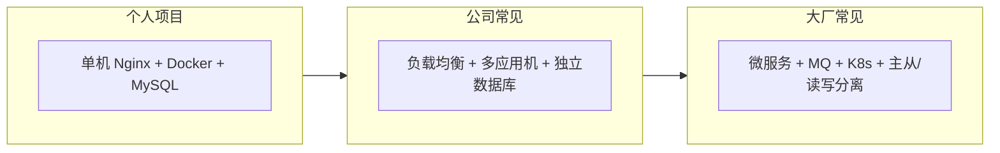

# 后端与架构技术归纳 · 学习路线

本文档整理个人博客项目实践过程中涉及的核心技术概念，并对照**中级开发工程师**应具备的知识面，给出**学习先后顺序**。

相关实操文档：[README.md](./README.md)（部署流程）、[DOCKER.md](./DOCKER.md)、[DEPLOY-CLOUD.md](./DEPLOY-CLOUD.md)。

---

## 一、架构演进总览



| 阶段 | 典型形态 | 本项目位置 |
|------|----------|------------|
| 入门 | 单体应用，本机开发 | ✅ `blog-api` + `blog/` + Docker |
| 上线 | Nginx 反代 + 单机 Docker 部署 | ✅ `39.108.73.54` |
| 扩展 | 应用多副本 + 负载均衡 + 库独立 | 公司 2 台应用 + 1 台库 |
| 规模化 | 微服务拆分 + MQ + K8s + 主从库 | 了解概念，按需深入 |

---

## 二、核心技术特点归纳

### 2.1 Nginx

| 维度 | 说明 |
|------|------|
| **是什么** | 高性能 Web 服务器与反向代理 |
| **在本项目** | 监听 80；`/` 托管静态博客；`/api/` 转发到 `127.0.0.1:5000` |
| **两大角色** | ① 静态资源服务器 ② 反向代理（统一对外入口） |
| **核心配置** | `root`、`try_files`、`location`、`proxy_pass`、`proxy_set_header` |
| **好处** | 对外只暴露 80/443；API/DB 藏在内网；同域减少 CORS；便于上 HTTPS |
| **注意** | `try_files` 找不到文件会回退 `index.html`（如 `admin.html` 未部署会显示首页） |

**反向代理一句话：** 访客只和 Nginx 说话，Nginx 再替访客访问后端 API。

**与本项目配置对应：**

```nginx
location /      { try_files $uri $uri/ /index.html; }
location /api/  { proxy_pass http://127.0.0.1:5000/api/; }
```

---

### 2.2 负载均衡（Load Balancing）

| 维度 | 说明 |
|------|------|
| **是什么** | 多台**相同**应用服务器前加调度层，把请求分摊到各实例 |
| **解决什么** | 单机扛不住流量；一台应用宕机另一台仍可服务；滚动发布 |
| **与反代的区别** | 反代 1 个后端 = 转发；反代 + `upstream` 多个后端 = **负载均衡** |
| **常见算法** | 轮询（默认）、加权轮询、最少连接、`ip_hash`（会话粘滞） |
| **常见实现** | Nginx `upstream`、阿里云 SLB、HAProxy、F5 |
| **与数据库** | 负载均衡针对**应用层**；数据库用主从/读写分离，是另一层 |

**Nginx 最小示例：**

```nginx
upstream api_servers {
    server 10.0.0.11:8080;
    server 10.0.0.12:8080;
}
location /api/ {
    proxy_pass http://api_servers/api/;
}
```

**公司架构对应：** 2 台放代码的服务器 + 前面 LB/SLB = 应用层横向扩展。

---

### 2.3 主从数据库（Master-Slave Replication）

| 维度 | 说明 |
|------|------|
| **是什么** | 主库（Master）负责写；从库（Slave）复制主库数据，主要承担读 |
| **解决什么** | 读压力大；备份与灾备；高可用（主挂掉可提升从库，需额外方案） |
| **复制方式** | 主库 binlog → 从库重放（有毫秒～秒级延迟） |
| **读写分离** | 写连主库，读连从库；注意「写完立刻读从库」可能读到旧数据 |
| **与并发** | 写仍只在主库；并发改同一行靠事务、乐观锁、悲观锁，主从不替代锁 |
| **本项目** | 单机 MySQL 容器，无主从；业务量小足够 |

**一句话：** 数据只存一份真相在主库，从库是副本；应用层多机 + 数据库主从是不同维度的扩展。

---

### 2.4 应用与数据库分机部署

| 维度 | 说明 |
|------|------|
| **是什么** | 应用服务器与数据库服务器分离（公司：2 台应用 + 1 台库） |
| **解决什么** | 安全（库不暴露公网）、性能（资源隔离）、独立备份与扩容 |
| **本项目** | 同一台机用 Docker 跑 API + MySQL，逻辑分离、物理合并 |
| **连接方式** | 应用通过内网 IP/主机名连接库；`ConnectionStrings` 指向库地址 |

---

### 2.5 并发与数据一致性（多应用机必读）

| 手段 | 特点 | 适用场景 |
|------|------|----------|
| **数据库事务 + 行锁** | 基础，InnoDB 默认 | 常规 UPDATE |
| **乐观锁（version）** | 更新时校验版本，冲突则重试 | 读多写少、冲突不激烈 |
| **悲观锁（FOR UPDATE）** | 读时锁行，性能较差 | 强一致、库存/余额 |
| **分布式锁（Redis）** | 跨应用实例互斥 | 复杂业务、防重复处理 |
| **幂等设计** | 同一业务键只处理一次 | 支付回调、MQ 消费 |
| **MQ 串行消费** | 按 key 分区顺序处理 | 削峰、异步 |

**原则：** 数据以数据库为唯一来源；应用服务器尽量**无状态**（Session 放 Redis 或 JWT）。

---

### 2.6 微服务（Microservices）

| 维度 | 说明 |
|------|------|
| **是什么** | 按业务能力拆成多个可独立部署、独立扩展的小服务 |
| **与多机部署区别** | 负载均衡：多台跑**同一套**代码；微服务：订单、支付、用户是**不同**服务 |
| **通信** | 同步 HTTP/gRPC；异步 MQ |
| **数据** | 常「一服务一库」，不能随意跨库 JOIN；用 API 组合、冗余字段、事件同步 |
| **代价** | 运维、链路追踪、分布式事务、配置中心复杂度陡增 |
| **本项目** | 单体 `blog-api`（留言 + 管理登录），适合当前规模 |

**演进：** 单体 → 单体多机（LB）→ 按域拆服务（微服务）→ 容器编排（K8s）。

---

### 2.7 消息队列 MQ（Message Queue）

| 维度 | 说明 |
|------|------|
| **是什么** | 生产者发消息到队列，消费者异步取出处理 |
| **解决什么** | 解耦、异步、削峰、最终一致 |
| **常见产品** | RabbitMQ（企业通用）、Kafka（高吞吐/日志）、RocketMQ（国内电商） |
| **核心概念** | Topic/Queue、Consumer Group、ACK、死信队列 |
| **必会坑** | 重复消费 → 幂等；顺序 → 分区/key；丢失 → 持久化 + 手动 ACK |
| **本项目** | 留言直接写库即可；扩展可做「留言后异步通知」 |

**典型流程：** 订单服务写库 → 发 `order.created` → 通知/积分服务订阅处理。

---

### 2.8 Kubernetes（K8s）

| 维度 | 说明 |
|------|------|
| **是什么** | 跨多台机器编排容器的平台（Pod、Deployment、Service、Ingress） |
| **与 Docker 关系** | Docker 管单个容器；K8s 管集群里成百上千容器 |
| **解决什么** | 自动调度、故障重启、滚动发布、弹性扩缩容 |
| **核心对象** | Deployment（几副本）、Service（稳定入口）、Ingress（HTTP 路由）、Secret/ConfigMap |
| **常用命令** | `kubectl apply/get/logs/scale` |
| **本项目** | `docker compose` 足够；K8s 适合服务多、有平台团队的场景 |

**云上等价：** 阿里云 ACK = 托管 K8s。

---

### 2.9 Docker（本项目已实践）

| 维度 | 说明 |
|------|------|
| **是什么** | 镜像 + 容器，环境一致、可重复部署 |
| **Compose** | 一条命令启动 MySQL + API；`docker-compose.prod.yml` 用于生产 |
| **注意** | 改 API 代码后需 `up -d --build`；前端改 `blog/` 只需复制静态文件 |
| **协作** | `git clone` 后他人可用同一 compose 拉起环境，减少手工装库 |

---

## 三、概念关系对照表

| 技术 | 作用层 | 解决的核心问题 | 个人博客是否需要 |
|------|--------|----------------|------------------|
| Nginx 反代 | 入口 | 统一域名、隐藏后端端口 | ✅ 需要 |
| 负载均衡 | 应用层 | 多实例分摊流量、高可用 | ❌ 单机不需要 |
| 主从数据库 | 数据层 | 读扩展、备份、灾备 | ❌ 流量小不需要 |
| 读写分离 | 数据层 | 减轻主库读压力 | ❌ |
| 微服务 | 架构 | 大系统拆分、独立发布 | ❌ 单体即可 |
| MQ | 集成层 | 异步、解耦、削峰 | ❌ 可选学习 |
| K8s | 运维层 | 大规模容器编排 | ❌ compose 即可 |
| Docker | 交付层 | 环境一致、快速部署 | ✅ 需要 |

---

## 四、中级开发工程师还应了解的内容

在以上架构之外，中级工程师通常还需具备以下能力（按领域）：

### 4.1 基础与语言（巩固）

- 一门主力语言进阶（如 C#：async/await、LINQ、依赖注入、中间件）
- HTTP/HTTPS、RESTful、状态码、Header、Cookie/Session/JWT
- SQL 进阶：索引、执行计划、事务隔离级别、慢查询优化
- 面向对象 + 常见设计模式（工厂、策略、仓储等，能读能写简单场景）

### 4.2 后端工程化

- 单元测试 / 集成测试（xUnit、Moq）
- 日志规范（结构化日志、日志级别、链路 ID）
- 配置分环境（Development / Production）
- API 版本管理、统一错误响应、参数校验
- 接口文档（Swagger/OpenAPI）

### 4.3 数据与缓存

- Redis：缓存、Session、分布式锁、过期策略
- 缓存问题：穿透、击穿、雪崩及常见对策
- EF Core 进阶：迁移、性能、乐观并发

### 4.4 安全

- OWASP 常见风险（SQL 注入、XSS、CSRF）
- 密码哈希、HTTPS、CORS、最小权限
- 密钥不入库、环境变量 / Secret 管理

### 4.5 运维与可观测性

- Linux 基础命令、进程、磁盘、日志位置
- CI/CD 概念（GitHub Actions、构建镜像、自动部署）
- 监控告警（指标、健康检查、502 排查）
- 备份与恢复（数据库 mysqldump）

### 4.6 分布式进阶（中级向高级过渡）

- 分布式事务认知（Saga、最终一致，不必先实现复杂方案）
- 服务注册发现（Nacos、Consul）概念
- API 网关（Kong、Ocelot、云网关）职责
- 链路追踪（SkyWalking、Jaeger）概念

### 4.7 软技能

- 读懂公司现有架构图与部署文档
- Code Review 习惯、Git 分支策略（Git Flow / trunk-based）
- 需求评估：何时不要过度设计（微服务/K8s）

---

## 五、学习先后顺序（建议 6～12 个月路径）

### 阶段 0：你已完成 ✅

- [x] 本机 Docker Compose 跑通 MySQL + API
- [x] 静态前端 + `config.js` + CORS
- [x] 云服务器 Nginx + 反代 + 防火墙
- [x] Git 推送与服务器 `git pull` 更新
- [x] 管理后台、EF Migrations 概念

**建议复盘：** 对照 [README.md](./README.md) 第十二节，能独立讲清一次留言从浏览器到数据库的路径。

---

### 阶段 1：夯实单体与运维（1～2 个月）

| 顺序 | 主题 | 具体行动 | 达标标准 |
|------|------|----------|----------|
| 1.1 | Linux 与 Nginx | 在服务器改 `blog.conf`，加 `gzip`、自定义错误页 | 能解释 `location` 匹配顺序 |
| 1.2 | Docker 进阶 | 使用 `docker-compose.db-only.yml` + 本机 `dotnet run` | 改 C# 不需 rebuild 镜像 |
| 1.3 | 数据库 | 为 `messages` 表加索引；练习 `EXPLAIN` | 能说出 Email、CreatedAt 索引用途 |
| 1.4 | 安全 | 改强 `.env` 密码；了解 SSH 密钥与防火墙限 IP | 生产不用默认 admin 密码 |
| 1.5 | HTTPS + 域名 | 备案后配置 certbot 或云证书 | 全站 HTTPS，`FRONTEND_ORIGIN` 同步 |

**推荐资料：** 本项目 [DOCKER.md](./DOCKER.md)、[DEPLOY-CLOUD.md](./DEPLOY-CLOUD.md)、Nginx 官方文档 `beginner's guide`。

---

### 阶段 2：并发、缓存与 API 质量（2～3 个月）

| 顺序 | 主题 | 具体行动 | 达标标准 |
|------|------|----------|----------|
| 2.1 | 并发控制 | 给 `Message` 加 `RowVersion` 乐观锁；读 EF 并发文档 | 能解释乐观锁 vs 悲观锁 |
| 2.2 | Redis | Docker 起 Redis；缓存文章列表或热点接口 | 能讲清缓存更新/删除策略 |
| 2.3 | 测试 | 为 `MessagesController` 写 2～3 个集成测试 | CI 里 `dotnet test` 通过 |
| 2.4 | 日志与排错 | 结构化日志 + 请求 ID；故意制造 502 并排查 | 能从日志定位一次失败请求 |
| 2.5 | 认证进阶 | 理解 JWT 结构；对比当前 Bearer Token 方案 | 能画登录到请求的 Token 流程 |

**推荐资料：** 《Redis 设计与实现》选读、ASP.NET Core 官方文档 Security / Performance。

---

### 阶段 3：分布式常见组件（2～3 个月）

| 顺序 | 主题 | 具体行动 | 达标标准 |
|------|------|----------|----------|
| 3.1 | 负载均衡 | 本地写双实例 `upstream` 实验（两个端口模拟） | 能手写轮询 `upstream` |
| 3.2 | 主从概念 | 阅读云 RDS「高可用/只读实例」文档 | 能画主从 + 读写分离图 |
| 3.3 | MQ 入门 | Docker 起 RabbitMQ；实现「留言成功 → 队列 → 打印通知」 | 理解生产者/消费者/ACK |
| 3.4 | 幂等 | 为 MQ 消费加 `messageId` 去重表 | 能解释为何 MQ 要幂等 |
| 3.5 | 微服务理论 | 画「单体 vs 微服务」调用图；读 1 篇拆分案例 | 能说明何时不该拆微服务 |

**推荐资料：** RabbitMQ 官方 tutorial、马丁·福勒《微服务》博客文章（中文版可查）。

---

### 阶段 4：容器编排与工程平台（2～4 个月，选学）

| 顺序 | 主题 | 具体行动 | 达标标准 |
|------|------|----------|----------|
| 4.1 | K8s 概念 | minikube 或 kind 本地集群；部署一个 Deployment | 说出 Pod/Service/Ingress 区别 |
| 4.2 | CI/CD | GitHub Actions：push 后 build + test | 主分支自动跑测试 |
| 4.3 | 可观测性 | 了解 Prometheus + Grafana 或云监控 | 能看 CPU、内存、QPS |
| 4.4 | 公司业务对齐 | 对照公司：SLB、RDS、MQ、日志平台 | 能画出公司架构简图 |

**推荐资料：** Kubernetes 官方教程（中文）、Docker 公司 «Getting Started with Kubernetes»。

---

### 阶段 5：中级综合验收（持续）

- 能独立部署一个「单体 + Nginx + Docker + MySQL」项目并写部署文档
- 能排查：页面 404、API 502、CORS、登录 401、数据库连接失败
- 能在面试中讲清：反代、LB、主从、微服务、MQ、K8s 各解决什么问题、何时不用
- 参与公司项目时，能对照架构图说出自己模块在哪一层

---

## 六、与本项目文档的索引

| 主题 | 文档 |
|------|------|
| 部署与上线 | [README.md](./README.md) |
| Docker 本地 | [DOCKER.md](./DOCKER.md) |
| 云服务器 | [DEPLOY-CLOUD.md](./DEPLOY-CLOUD.md) |
| API 与安全 | [DEPLOY.md](./DEPLOY.md) |
| Nginx 双域名示例 | [deploy/nginx/blog.conf.example](./deploy/nginx/blog.conf.example) |
| 架构与技术学习 | **本文 TECH.md** |

---

## 七、Quick Reference（面试/复习用）

```
Nginx 反代    → 统一入口，/api 转到内网 API
负载均衡      → 多台相同应用分摊请求（upstream / SLB）
主从数据库    → 主写从读，复制延迟要注意
分机部署      → 应用机 + 数据库机，内网连接
并发          → 事务 / 乐观锁 / 悲观锁 / Redis 锁 / 幂等
微服务        → 按业务拆服务，独立部署，常配合 MQ
MQ            → 异步解耦削峰，要幂等和 ACK
K8s           → 集群编排容器，替代手工 multi-docker
Docker        → 镜像与容器，compose 一键环境
```

---

*文档版本：2026-05-29 · 基于墨言博客项目实践与架构讨论整理*
