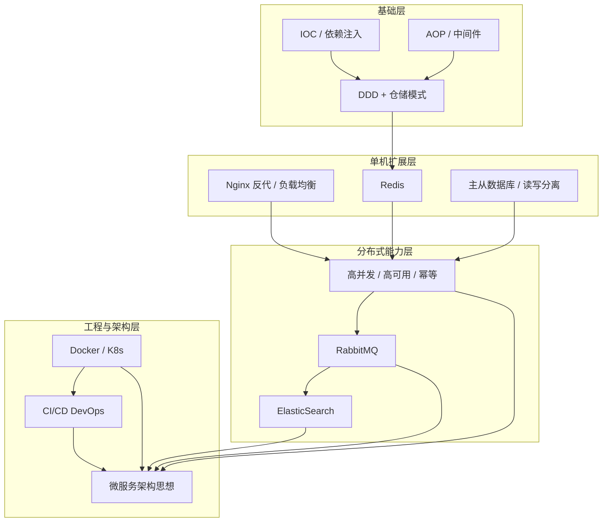

# ASP.NET 工程师进阶学习路径

> 面向 C# / ASP.NET Core 开发工程师，基于当前墨言博客项目（单体 API + Docker + Nginx + MySQL）整理。  
> 相关文档：[TECH.md](./TECH.md)（架构概念）、[README.md](./README.md)（部署实践）

---

## 一、技术全景与依赖关系

先建立「谁依赖谁」的全局图，再按阶段学习，避免一上来就啃微服务/K8s 却连幂等和缓存都没落地。



**核心原则：** 先能在单体里把事做对（IOC、仓储、Redis、幂等），再学怎么拆（微服务）和怎么运（K8s、CI/CD）。

---

## 二、推荐学习顺序（6 个阶段）

| 阶段 | 周期建议 | 主题 | 为什么在这个位置 |
|------|----------|------|------------------|
| **0** | 已完成 ✅ | Docker 基础、Nginx 反代、单体部署 | 你的博客项目已实践，作为后续所有实验的「靶场」 |
| **1** | 3～4 周 | IOC / AOP、DDD + 仓储模式 | 代码组织与架构思维的地基；ASP.NET Core 每天都在用，但要「知其所以然」 |
| **2** | 4～6 周 | Nginx 负载均衡、Redis、主从数据库 | 单机 → 多实例 → 读写分离，解决「流量变大、读多写少」 |
| **3** | 4～6 周 | 高并发 / 高可用 / 幂等 | 在 Redis + 数据库基础上，处理重复请求、并发写、故障恢复 |
| **4** | 4～6 周 | RabbitMQ、ElasticSearch | 异步解耦 + 搜索；与幂等、最终一致强相关 |
| **5** | 6～8 周 | CI/CD、Docker 进阶、K8s | 把上面能力自动化交付、集群化运行 |
| **6** | 持续 | 微服务架构设计思想 | **最后学**：需要前面所有组件都「用过、踩过坑」再谈拆分 |

**总时长：** 约 6～12 个月（在职学习，按每周 8～12 小时估算）。

---

## 三、分阶段详解

### 阶段 0：已有基础（复盘即可）

你已在 [README.md](./README.md) 中完成：

- Docker Compose 跑 MySQL + `blog-api`
- Nginx 反向代理 `/api/` → 内网 5000 端口
- 云服务器部署与 Git 更新

**复盘任务：** 能不看文档，口述一次「用户提交留言 → Nginx → API → EF Core → MySQL」全链路。

---

### 阶段 1：IOC / AOP + DDD + 仓储模式

> **目标：** 写出结构清晰、可测试、易扩展的单体代码——这也是微服务里「每个服务内部」应有的样子。

#### 1.1 IOC（控制反转）与依赖注入

| 要点 | 说明 |
|------|------|
| 是什么 | 对象依赖由容器创建和注入，而不是 `new` |
| ASP.NET 中的体现 | `Program.cs` 里 `builder.Services.AddScoped<IMessageRepository, MessageRepository>()` |
| 生命周期 | Singleton / Scoped / Transient 的区别与误用场景 |
| 与单元测试 | 接口 + Mock，可替换真实数据库 |

**实践建议（博客项目）：**

1. 把 `MessagesController` 里直接访问 `DbContext` 的逻辑，抽到 `IMessageRepository` + `MessageRepository`。
2. 把「校验 + 写库」抽到 `IMessageService`，Controller 只负责 HTTP。

**达标标准：** 能解释为什么 Controller 不应直接 `new DbContext`，以及 Scoped 为何适合 Repository。

#### 1.2 AOP（面向切面编程）

| 要点 | 说明 |
|------|------|
| 是什么 | 日志、鉴权、异常、缓存等横切关注点与业务代码分离 |
| ASP.NET 中的体现 | **中间件（Middleware）**、**Filter**、**Interceptor**（EF / Castle DynamicProxy） |
| 常见场景 | 统一异常处理、请求日志、性能计时、权限校验 |

**实践建议：**

1. 写一个全局异常处理中间件，统一返回 JSON 错误格式。
2. 写一个 Action Filter 记录每个 API 耗时。
3. 了解 `IHostedService` 做后台任务（与 MQ 消费预热）。

**达标标准：** 能区分 Middleware vs Filter 的执行顺序和适用场景。

#### 1.3 DDD（领域驱动设计）+ 仓储模式

| 要点 | 说明 |
|------|------|
| DDD 核心 | 以业务领域为中心：实体、值对象、聚合根、领域服务、领域事件 |
| 仓储模式 | 持久化细节对领域层透明；`IRepository<T>` 抽象数据访问 |
| 不必一步到位 | 博客规模用「轻量 DDD」即可：Service + Repository + 清晰命名 |
| 与 EF Core | Repository 内部用 DbContext；复杂查询可用 Specification 模式 |

**实践建议：**

1. 定义 `Message` 聚合（实体 + 创建规则，如 Email 格式、内容长度）。
2. `IMessageRepository` 只暴露 `AddAsync`、`GetByIdAsync`、`ListAsync`，不暴露 `IQueryable` 给 Controller。
3. 读 [TECH.md](./TECH.md) 第四节「设计模式」对照，避免过度抽象。

**达标标准：** 能画出「Controller → Application Service → Repository → DbContext」分层图，并说明每层职责。

**推荐资料：**

- 《ASP.NET Core 依赖注入》官方文档
- 《领域驱动设计》Eric Evans（选读第 1～5 章）
- 博客园 / 掘金搜索「ASP.NET Core 仓储模式 最佳实践」

---

### 阶段 2：Nginx 负载均衡 + Redis + 主从数据库

> **目标：** 理解「应用层横向扩展」和「数据层读扩展」，为高并发打基础。

#### 2.1 Nginx 反向代理与负载均衡

| 主题 | 内容 |
|------|------|
| 反向代理 | 你已在用：`proxy_pass` 把 `/api/` 转到后端 |
| 负载均衡 | `upstream` 配置多台相同 API 实例，轮询 / 加权 / `ip_hash` |
| 健康检查 | `max_fails`、`fail_timeout`；生产可用云 SLB |
| HTTPS | `certbot` 或云证书，与 `FRONTEND_ORIGIN` 联动 |

**实践建议：**

1. 本地用两个端口启动两个 `blog-api` 实例，Nginx `upstream` 轮询。
2. 观察某实例挂掉时 Nginx 行为（理解高可用的入口层）。

**达标标准：** 能手写带 `upstream` 的 Nginx 配置，并解释与「微服务网关」的区别。

#### 2.2 Redis

| 主题 | 内容 |
|------|------|
| 数据结构 | String、Hash、List、Set、Sorted Set |
| 典型用途 | 缓存、Session、分布式锁、限流计数、排行榜 |
| .NET 客户端 | `StackExchange.Redis` 或 `Microsoft.Extensions.Caching.StackExchangeRedis` |
| 经典问题 | 缓存穿透 / 击穿 / 雪崩及对策 |

**实践建议（博客项目）：**

1. Docker Compose 增加 Redis 服务。
2. 为「留言列表」接口加缓存，设置合理 TTL。
3. 用 Redis 实现「同一 Email 60 秒内只能提交一次」限流。

**达标标准：** 能讲清 Cache-Aside 模式，以及更新数据库后如何失效缓存。

#### 2.3 主从数据库（Master-Slave）

| 主题 | 内容 |
|------|------|
| 原理 | 主库写 binlog，从库重放；读写分离 |
| 延迟 | 写完立刻读从库可能读到旧数据 → 关键读走主库或稍等 |
| 与并发 | 主从不替代行锁；并发写仍在主库 |
| 云实践 | 阿里云 RDS 高可用版、只读实例 |

**实践建议：**

1. 本地 Docker 搭 MySQL 主从（或阅读 RDS 文档 + 画架构图）。
2. 在代码里配置「写连接串 / 读连接串」（可用 EF Core 双 DbContext 或中间件路由）。

**达标标准：** 能画「2 台 API + 1 主 1 从 MySQL」架构图，并说明各组件职责。

**推荐资料：**

- Redis 官方文档 Quick Start
- Nginx `ngx_http_upstream_module` 文档
- MySQL 8.0 Replication 文档

---

### 阶段 3：高并发 / 高可用 / 幂等

> **目标：** 在分布式、多实例、MQ 环境下，保证数据正确性和系统可恢复性。

#### 3.1 高并发

| 手段 | 说明 |
|------|------|
| 应用无状态 | Session 放 Redis 或 JWT；任意实例可处理请求 |
| 连接池 | 数据库、Redis、HttpClient 连接池调优 |
| 异步 | `async/await` 释放线程；避免阻塞 |
| 削峰 | 请求先入队（MQ），后台慢慢消费 |
| 限流 | Nginx `limit_req`、Redis 计数、网关限流 |

#### 3.2 高可用

| 层次 | 手段 |
|------|------|
| 入口 | Nginx / SLB 多实例 |
| 应用 | 多副本 + 健康检查 + 滚动发布 |
| 缓存 | Redis 哨兵 / 集群 |
| 数据库 | 主从 + 自动 failover（MHA / 云 RDS） |
| 降级熔断 | Polly（.NET 重试、熔断、超时） |

#### 3.3 幂等（极其重要）

| 场景 | 做法 |
|------|------|
| HTTP 重复提交 | 前端防抖 + 后端 `Idempotency-Key` + Redis/DB 去重 |
| 支付 / 回调 | 业务唯一键（订单号）+ 状态机，已处理则直接返回成功 |
| MQ 重复消费 | 消费前查 `messageId` 是否已处理；或数据库唯一约束 |
| 数据库 | 唯一索引（如 `Email + CreatedAt` 窗口）防止重复插入 |

**实践建议：**

1. 留言接口增加 `X-Request-Id`，Redis 记录 24h 内已处理的 ID。
2. 用 JMeter / k6 对留言接口压测，观察连接池与响应时间。
3. 引入 Polly 为调用外部 HTTP 接口加重试与熔断。

**达标标准：** 能举例说明「为什么 MQ 必须幂等」「为什么支付回调要幂等」，并在博客项目里实现一种去重方案。

**推荐资料：**

- 《高并发系统设计 40 问》（极客时间，选读）
- Polly 官方文档
- [TECH.md](./TECH.md) 第 2.5 节「并发与数据一致性」

---

### 阶段 4：RabbitMQ + ElasticSearch

> **目标：** 异步解耦与全文检索——微服务间协作的两块常见拼图。

#### 4.1 RabbitMQ

| 概念 | 说明 |
|------|------|
| 核心模型 | Exchange、Queue、Binding、Routing Key |
| 模式 | 简单队列、Work Queue、Pub/Sub、Routing、Topic |
| 可靠性 | 持久化、Publisher Confirm、Manual ACK、死信队列 |
| .NET | `RabbitMQ.Client` 或 MassTransit（更推荐，封装好） |

**实践建议：**

1. Docker 启动 RabbitMQ（带 Management 插件）。
2. 留言成功后发布 `MessageCreated` 事件 → 消费者发邮件通知 / 写日志（先 `Console.WriteLine` 即可）。
3. **重点：** 消费者用 `messageId` 做幂等，重复消息不重复发通知。

**达标标准：** 能画出 Producer → Exchange → Queue → Consumer 图，并解释 ACK 与死信队列用途。

#### 4.2 ElasticSearch

| 概念 | 说明 |
|------|------|
| 是什么 | 分布式搜索引擎，倒排索引，适合全文检索、日志分析 |
| 与 MySQL 关系 | MySQL 是真相源；ES 是查询视图，通过 MQ / Canal 同步 |
| 核心概念 | Index、Document、Mapping、Analyzer、Query DSL |
| .NET | NEST 或 Elastic.Clients.Elasticsearch |

**实践建议：**

1. Docker 启动单节点 ES + Kibana。
2. 将留言同步到 ES（可先同步调用，再用 RabbitMQ 异步同步）。
3. 实现「按关键词搜索留言内容」API，对比 MySQL `LIKE` 的性能差异。

**学习顺序说明：** 建议 **先 RabbitMQ 再 ES**，因为生产里常见「写 MySQL → 发 MQ → 消费者更新 ES」链路，幂等也在 MQ 侧练过一遍。

**达标标准：** 能解释「为什么搜索不用 MySQL LIKE 扛高并发」，以及 ES 与 MySQL 数据不一致时的处理思路。

**推荐资料：**

- RabbitMQ 官方 Get Started（含 .NET 示例）
- Elastic 官方 «Search Labs»
- MassTransit 文档（.NET 集成 RabbitMQ）

---

### 阶段 5：CI/CD + Docker 进阶 + Kubernetes

> **目标：** 代码提交后自动构建、测试、部署；容器从单机 Compose 走向集群编排。

#### 5.1 CI/CD（DevOps）

| 环节 | 典型工具 |
|------|----------|
| 代码托管 | GitHub / GitLab / Azure DevOps |
| CI | 拉代码 → `dotnet restore/build/test` → 构建 Docker 镜像 |
| CD | 推送镜像到仓库 → SSH / K8s 滚动更新 |
| 质量门禁 | 单元测试失败则阻断合并 |

**实践建议：**

1. 为 `blog-api` 写 GitHub Actions：push 到 `main` 时跑 `dotnet test`。
2. 增加一步 `docker build` 并 push 到阿里云 ACR 或 Docker Hub。
3. 服务器 webhook 或 Actions SSH 执行 `docker compose pull && up -d`。

**达标标准：** 一次 git push 能自动跑测试；能说清 CI 与 CD 的区别。

#### 5.2 Docker 进阶

| 主题 | 内容 |
|------|------|
| 镜像优化 | 多阶段构建、`dotnet publish` 精简镜像体积 |
| 网络 | bridge / host；Compose 服务名 DNS |
| 数据卷 | 数据库持久化；备份策略 |
| 安全 | 非 root 用户运行容器；`.env` 不进镜像 |

**实践建议：** 优化 `blog-api/Dockerfile`，镜像体积减小；编写 `docker-compose` 一键起 MySQL + Redis + RabbitMQ + API。

#### 5.3 Kubernetes（K8s）

| 概念 | 说明 |
|------|------|
| 与 Docker 关系 | Docker 运行容器；K8s 在集群中调度、扩缩容、自愈 |
| 核心对象 | Pod、Deployment、Service、Ingress、ConfigMap、Secret |
| .NET 部署 | 容器化 API → Deployment；Service 暴露；Ingress 替代部分 Nginx 职责 |

**实践建议：**

1. 本地用 minikube 或 Docker Desktop 内置 K8s。
2. 把 `blog-api` 部署为 Deployment（2 副本）+ Service。
3. 理解滚动更新与 `kubectl rollout undo`。

**达标标准：** 能说出 Pod / Deployment / Service / Ingress 各解决什么问题；知道何时用 Compose、何时上 K8s。

**推荐资料：**

- GitHub Actions 官方文档
- 《Docker 实战》
- Kubernetes 官方教程（中文）或 B 站「K8s 入门」

---

### 阶段 6：微服务架构设计思想（压轴）

> **目标：** 知道何时拆、怎么拆、拆完带来什么代价——不是「为了微服务而微服务」。

#### 6.1 核心思想

| 主题 | 内容 |
|------|------|
| 拆分依据 | **业务能力 / 限界上下文**，不是按 Controller 数量 |
| 通信 | 同步 REST/gRPC（查询、实时）；异步 MQ（事件、削峰） |
| 数据 | 一服务一库；禁止跨库 JOIN；最终一致 |
| 基础设施 | 注册发现、配置中心、API 网关、链路追踪 |
| 代价 | 分布式事务、运维复杂度、调试难度上升 |

#### 6.2 与「多机部署」的区别

| 对比 | 多机 + 负载均衡 | 微服务 |
|------|-----------------|--------|
| 代码 | 同一套 `blog-api` 多实例 | 用户服务、留言服务、搜索服务 **不同代码库** |
| 扩展 | 整体扩容 | 按服务独立扩容（搜索服务多副本） |
| 数据 | 通常共用一个库 | 各服务独立数据库 |

#### 6.3 演进路径（与你项目对应）

```
单体 blog-api（当前）
    ↓ 流量增大
单体 + Nginx 负载均衡 + Redis + 主从库
    ↓ 团队 / 业务变大
按域拆分：MessageService + SearchService（ES）+ NotifyService（MQ）
    ↓ 实例众多
K8s 编排 + CI/CD + 可观测性平台
```

**实践建议：**

1. **纸上设计：** 把博客拆成「留言服务 + 搜索服务 + 通知服务」，画调用图与数据归属。
2. **不必真拆：** 当前规模单体更合适；理解思想即可。
3. 读马丁·福勒《Microservices》系列文章；对照公司架构图标注各组件。

**达标标准：** 面试能回答「什么时候不该用微服务」；能结合 RabbitMQ、ES、Redis 说明一个完整分布式场景。

**推荐资料：**

- martinfowler.com «Microservices»
- 《微服务设计》Sam Newman
- .NET 微服务参考架构（Microsoft eShopOnContainers，选读）

---

## 四、技术点速查表

| 技术 | 解决什么问题 | 建议阶段 | 博客项目可实践 |
|------|--------------|----------|----------------|
| IOC / DI | 解耦、可测试 | 1 | Repository 注入 |
| AOP | 日志、鉴权、异常横切 | 1 | 全局异常中间件 |
| DDD + 仓储 | 清晰分层、领域建模 | 1 | Message 聚合 + Repository |
| Nginx 反代 | 统一入口、隐藏后端 | 0 ✅ | 已部署 |
| Nginx 负载均衡 | 多 API 实例分摊流量 | 2 | 本地双实例实验 |
| Redis | 缓存、锁、限流、Session | 2 | 留言列表缓存、防刷 |
| 主从数据库 | 读扩展、备份 | 2 | 读文档 + 画架构图 |
| 高并发 / 高可用 | 扛流量、故障恢复 | 3 | 压测 + Polly |
| 幂等 | 重复请求不重复处理 | 3 | Request-Id 去重 |
| RabbitMQ | 异步、解耦、削峰 | 4 | 留言后异步通知 |
| ElasticSearch | 全文搜索、日志检索 | 4 | 留言关键词搜索 |
| CI/CD | 自动构建测试部署 | 5 | GitHub Actions |
| Docker | 环境一致、交付 | 0 ✅ / 5 进阶 | 多阶段 Dockerfile |
| K8s | 集群编排、弹性伸缩 | 5 | minikube 部署 API |
| 微服务思想 | 大系统拆分与治理 | 6 | 纸上拆分设计 |

---

## 五、学习建议（针对 ASP.NET 工程师）

### 5.1 学习方法

1. **以项目驱动，不要纯看视频**  
   每学一个技术，就在 `blog-api` 或本地实验环境加一个小功能；学 Redis 就加缓存，学 MQ 就加异步通知。

2. **先跑通再优化**  
   Docker 单容器 → Compose 多服务 → K8s 两副本；不要第一步就追求 HA 集群。

3. **画图 + 讲给别人听**  
   每完成一个阶段，画一张架构图并用 5 分钟讲清数据流；费曼学习法对架构知识特别有效。

4. **对照 TECH.md 复盘**  
   [TECH.md](./TECH.md) 里已有 Nginx、LB、主从、MQ、K8s 概念归纳；学完每个点后回去标记「已实践」。

5. **记录踩坑**  
   建一个 `notes/` 或私人仓库，记录：CORS、502、MQ 重复消费、ES 同步延迟等——面试时都是素材。

### 5.2 常见误区

| 误区 | 正确做法 |
|------|----------|
| 先学微服务再学 Redis/MQ | 微服务是「封顶」；底层组件要先会用 |
| 把 DDD 做成过度抽象 | 博客规模：Service + Repository 足够 |
| 忽略幂等只关心「能跑」 | MQ、支付、回调场景幂等是必考题 |
| 本地从不压测 | 用 k6/JMeter 压留言接口，建立性能直觉 |
| K8s 代替 Docker 基础 | Compose 熟练后再学 K8s，否则排查困难 |
| ES 替代 MySQL | MySQL 是真相源；ES 是搜索视图 |

### 5.3 时间分配建议（每周 10 小时示例）

| 活动 | 时间 |
|------|------|
| 官方文档 / 书 | 3h |
| 动手实验（博客项目） | 5h |
| 总结笔记 / 画图 | 1h |
| 阅读一篇架构案例 | 1h |

### 5.4 检验清单（中级 → 中高级）

- [ ] 能独立搭建：Nginx + 双 API 实例 + Redis + MySQL 主从（概念或实验环境）
- [ ] 能实现：留言 → RabbitMQ → 消费者，且消费幂等
- [ ] 能实现：留言同步 ES 并提供搜索 API
- [ ] 能配置：GitHub Actions 自动 `dotnet test` + Docker build
- [ ] 能在 minikube 部署 API Deployment 并滚动更新
- [ ] 能白板讲解：微服务拆分边界、一服务一库、最终一致
- [ ] 能排查：502、缓存不一致、MQ 堆积、ES 与 MySQL 数据延迟

---

## 六、推荐学习资源

### 官方文档（优先）

- [ASP.NET Core 文档](https://learn.microsoft.com/zh-cn/aspnet/core/)
- [Entity Framework Core](https://learn.microsoft.com/zh-cn/ef/core/)
- [Redis 文档](https://redis.io/docs/)
- [RabbitMQ Tutorials](https://www.rabbitmq.com/tutorials)
- [Elastic 指南](https://www.elastic.co/guide/index.html)
- [Docker 文档](https://docs.docker.com/)
- [Kubernetes 文档](https://kubernetes.io/zh-cn/docs/home/)

### 书籍 / 课程（选读）

| 方向 | 资源 |
|------|------|
| DDD | 《领域驱动设计》Eric Evans；《实现领域驱动设计》Vaughn Vernon |
| 分布式 | 《微服务设计》Sam Newman；《数据密集型应用系统设计》DDIA（进阶） |
| Redis | 《Redis 设计与实现》黄健宏 |
| 消息队列 | 《RabbitMQ 实战》 |
| .NET 微服务 | eShopOnContainers 示例仓库 |

### 与本仓库文档联动

| 文档 | 用途 |
|------|------|
| [README.md](./README.md) | 部署流程、全链路理解 |
| [TECH.md](./TECH.md) | 架构概念、阶段 0～5 对照 |
| [DOCKER.md](./DOCKER.md) | Docker 本地实践 |
| [DEPLOY-CLOUD.md](./DEPLOY-CLOUD.md) | 云服务器与 Nginx |

---

## 七、Quick Reference（复习 / 面试用）

```
IOC/DI     → 依赖由容器注入，便于测试与替换实现
AOP        → 日志/鉴权/异常与业务分离（Middleware、Filter）
DDD+仓储   → 领域建模 + IRepository 隐藏持久化细节

Nginx 反代 → 统一入口，/api 转到内网 API
负载均衡   → upstream 多实例轮询，应用层扩展
Redis      → 缓存、锁、限流；注意穿透/击穿/雪崩
主从库     → 主写从读，注意复制延迟

高并发     → 无状态、异步、池化、削峰、限流
高可用     → 多副本、健康检查、熔断降级、故障转移
幂等       → 同一业务键只处理一次（HTTP/MQ/回调必考）

RabbitMQ   → 异步解耦削峰；持久化 + ACK + 幂等消费
ES         → 全文检索；MySQL 同步过来，不做唯一真相源

CI/CD      → 提交即构建测试；合格产物自动部署
Docker     → 镜像交付；Compose 本地，K8s 集群
K8s        → Pod/Deployment/Service/Ingress 编排与扩缩容
微服务     → 按业务能力拆分，一服务一库，最后再学
```

---

*文档版本：2026-06-04 · 基于 ASP.NET 工程师技术清单与墨言博客项目整理*
